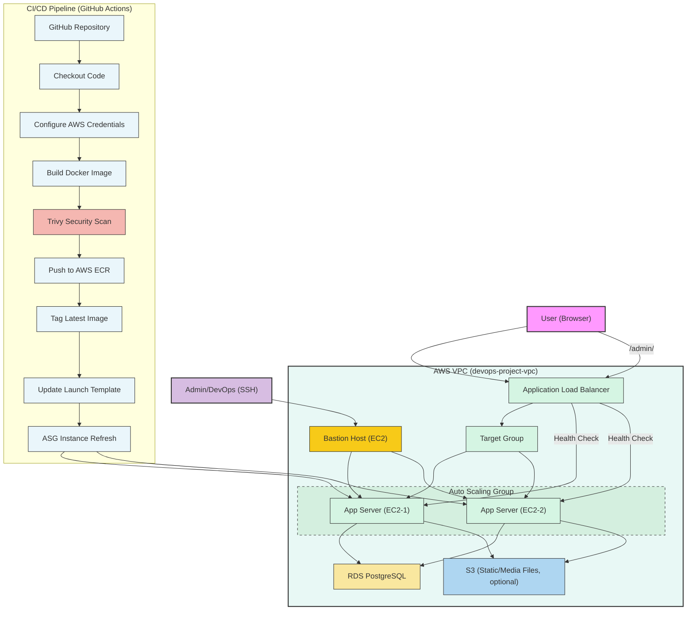

# DevOps Project

A full-lifecycle DevOps pipeline for deploying a scalable, resilient **ecommerce Django web application** on AWS.  
This project demonstrates modern cloud infrastructure, automation, and security best practices.

---

## Project Stack

- **Application:** Django (Python) — Ecommerce site
- **Database:** AWS RDS PostgreSQL
- **Containerization:** Docker
- **Infrastructure as Code:** Terraform
- **CI/CD:** GitHub Actions
- **Cloud Provider:** AWS (EC2, ALB, ASG, RDS, S3, ECR)
- **Security:** Bastion Host, Security Groups
- **Monitoring:** CloudWatch, Health Checks
- **Vulnerability Scanning:** Trivy

---

## Features

- **Ecommerce Functionality:** Product listing, admin management, and extensible for cart/checkout.
- **Automated Infrastructure:** Provision AWS resources using Terraform.
- **CI/CD Pipeline:** Build, scan, and deploy Docker images via GitHub Actions.
- **Scalable Architecture:** Auto Scaling Group for high availability.
- **Secure Access:** Bastion host for admin SSH; security groups for segmentation.
- **Monitoring & Logging:** Health checks and CloudWatch integration.
- **Persistent Storage:** RDS PostgreSQL and optional S3 for static/media files.
- **Admin Panel:** Django admin for product/user management.

---

## Architecture Overview

The diagram below illustrates the end-to-end flow:  
- **Users** access the web app via the Load Balancer.
- **Admins/DevOps** access EC2 instances securely via the Bastion Host.
- **CI/CD pipeline** automates build, security scan, and deployment.
- **Auto Scaling Group** maintains multiple app servers for reliability.
- **Database and storage** are managed via AWS RDS and S3.

---

## CI/CD Pipeline Details

- **Build:** Docker image is built from the Django source code.
- **Scan:** Trivy scans the image for vulnerabilities (pipeline fails on CRITICAL/HIGH).
- **Push:** Secure image is pushed to AWS ECR.
- **Deploy:** Launch template is updated and ASG triggers instance refresh for zero-downtime deployment.

---

## Usage

1. **Clone the repository** and review the Terraform files.
2. **Configure AWS credentials** and run `terraform apply` to provision infrastructure.
3. **Push code changes** to GitHub to trigger CI/CD and deploy updates.
4. **Access the ecommerce app** via the ALB DNS name.
5. **Manage products** via the Django admin panel (`/admin/`).

---

## Author

Leney Gannasan (ami3g)
Email: amitesh3000@yahoo.com

---
